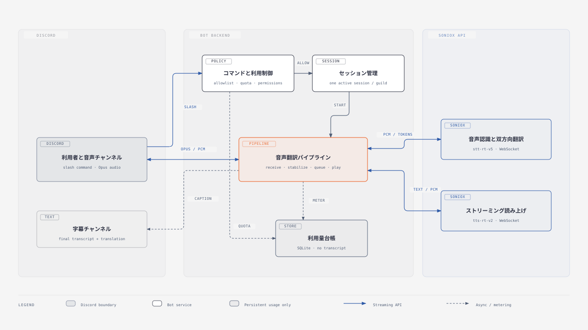
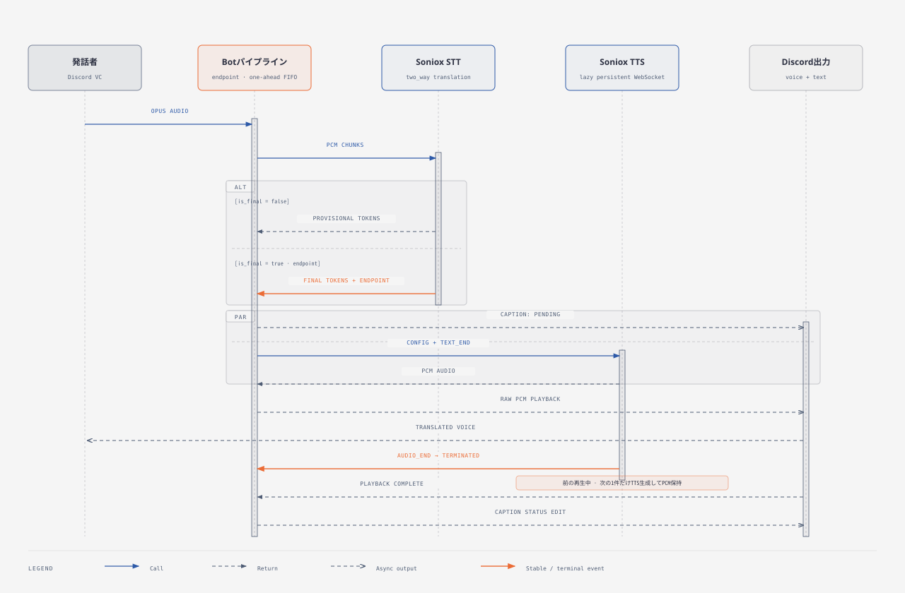
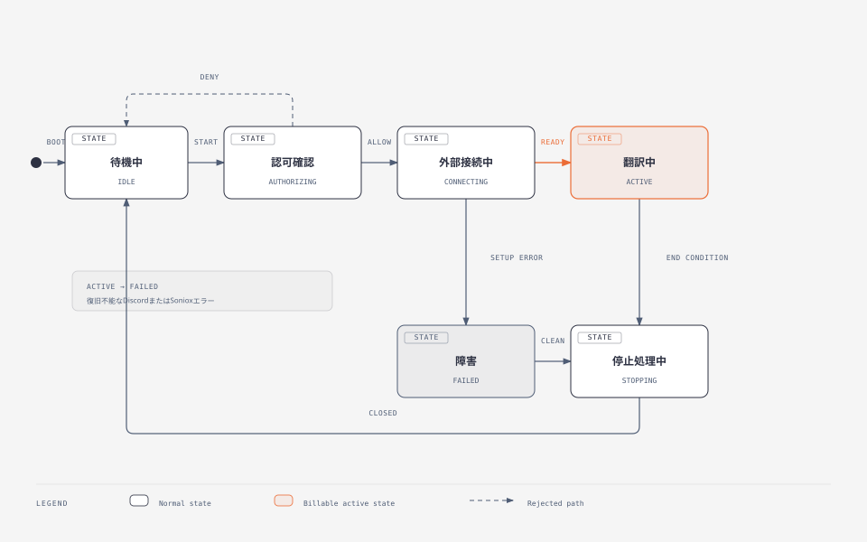

# Discord Realtime Translation Bot 設計書

Discordの音声チャンネルで、日本語・韓国語・英語の会話を双方向に翻訳するBotの設計書である。

導入と起動は[README](../README.md)、公開前の安全性調査は[公開前セキュリティ監査](../security_best_practices_report.md)を参照する。

| 用語 | この文書での意味 |
|---|---|
| Guild | Discord API上のサーバー |
| セッション | 1つのGuildで翻訳を開始してから停止するまでの実行単位 |
| STT | 音声を文字にし、同時に翻訳するSonioxの処理 |
| TTS | 翻訳文から読み上げ音声を作るSonioxの処理 |
| E2E | Discordの音声入力からSonioxを経て、字幕と翻訳音声がDiscordへ戻るまでの実サービス確認 |
| 利用量台帳 | STT・TTS・テキストの利用量と費用を記録するSQLiteデータベース |

## 1. それを作ろうと思った背景

出発点は、言語の異なる複数人の人物が、専用のアプリを用いること無く会話をできるようにしたい。というところからスタートした。

最初に検討したのは、音声を入れると翻訳音声まで返す一体型APIと、音声認識・翻訳・読み上げを分ける方式である。一体型は遅延を抑えやすいが、従量課金が高額になりやすく、用語や読み上げ音声の種類（voice）を調整しにくい。字幕だけにすると安くなるものの、当初ほしかった音声会話から離れる。そのため、Sonioxで音声認識と双方向翻訳を行い、確定した翻訳文をSoniox TTSへ渡す分割型を採用した。MVPでは、費用を上限内に収めることと、固有名詞や読み上げ音声を調整できることを優先した。

もう一つの課題として、BotのAPI Keyを使って第三者が勝手に課金を発生させることへの対策があった。
そのため、API Keyは利用者へ渡さず、Botの実行環境に置く。そのうえで、利用できるGuildとUserを許可リストへ限定し、User・Guild・Bot全体に月間上限を設ける方針を採用した。

Discordでは、Botが音声チャンネルへ流した音声を参加者ごとに出し分けられない。3言語を同時に扱うと、全員が複数の翻訳音声を聞くことになる。そこで1セッションは2言語に絞り、日韓・日英・韓英の3ペアから選ぶ仕様にした。

## 2. スコープ

### 対象

- 言語ペアは`ja-ko`、`ja-en`、`ko-en`
- 1セッションの人間参加者は1〜3人。
- 同じGuildでは開始中を含めて同時に1セッション
- 発話者ごとにSTTストリームとvoiceを分離
- 仮字幕と確定字幕を専用の公開スレッドへ表示
- 現在のセッション状態を実行者だけに表示
- 公開スレッドに残るBotの確定字幕をMarkdownで出力
- Guild・言語ペアごとの翻訳用語をSQLiteへ登録・一覧表示・削除
- 話者ごとに音声認識で優先する言語を指定
- 確定翻訳だけをTTSへ送り、発話の確定順に再生
- 会話優先と正確さ優先の2モード
- 実行中のセッションごとに0.7〜1.3倍の読み上げ速度を変更
- User・Guild・Globalの月間利用上限
- 音声、字幕本文、表示名をBotの永続ストレージとログへ保存しない
- Docker Composeを標準の配置経路とする

### 対象外

- 不特定多数が追加できる公開Bot
- 4人以上、3言語以上、または日韓英以外の会話
- 参加者ごとに異なる翻訳音声を聞かせること
- 音声録音、字幕検索、Bot独自の会話履歴保存
- 話者の自動登録、課金、管理画面、利用者によるAPI Key登録
- 非公開スレッドやDMへの字幕配信
- 完全な同時通訳、または再生開始300 ms以内の保証

## 3. ユーザーから見た仕様(外部インターフェース)

### 基本の利用手順

1. 許可された利用者が同じ音声チャンネルへ参加する
2. 字幕を表示してよいテキストチャンネルで`/translate start`を実行する
3. 日韓・日英・韓英から言語ペアを選ぶ。必要なら再生モードも選ぶ
4. Botが同じ音声チャンネルへ入り、親チャンネルへセッションカードを出す
5. カードから作られた公開スレッドへ字幕が流れ、翻訳音声が音声チャンネルで再生される
6. カードの停止ボタン、または`/translate stop`で終了する

### コマンド

| コマンド | 引数 | 動作 |
|---|---|---|
| `/translate start` | `pair`必須、`mode`任意 | 実行者が参加中の音声チャンネルで翻訳を開始する |
| `/translate speed` | `rate`必須。0.7〜1.3 | 現在のセッションだけ読み上げ速度を変える。次に生成する翻訳音声から反映する |
| `/translate stop` | なし | 実行中または開始中のセッションを停止する |
| `/status` | なし | 現在の状態、言語ペア、参加者、経過時間、モード、読み上げ速度、音声の有無、字幕スレッドを表示する |
| `/language show` | `user`任意 | 話者に設定されている音声認識言語を表示する |
| `/language set` | `language`必須、`user`任意 | 話者の音声認識言語を保存し、次のセッションから使う |
| `/export` | 公開スレッドの`thread`任意 | 対象スレッドにあるBotの確定字幕をMarkdownで出力する。省略時はコマンドを実行した公開スレッドを使う |
| `/register add` | `pair`、`source`、`target`必須 | Guild用の翻訳用語を保存し、同じ`source`があれば更新する |
| `/register list` | `pair`任意 | Guild登録用語を一覧表示する。省略時は全言語ペアを表示する |
| `/register delete` | `pair`、`source`必須 | Guild登録用語を完全一致で削除する。`source`は入力補完を使える |

`pair`は3言語ペアの選択肢だけを受け付ける。`mode`を省略すると会話優先の`conversation`になる。コマンドはGuild内だけで使える。`/translate`のDiscord上の既定権限は管理者のみで、一般メンバーへ使わせる場合はDiscordのIntegrationsでロールまたはUserへ明示的に許可する。`/status`、`/language`、`/export`、`/register`はGuildの全メンバーに表示するが、Bot側では4コマンドともGuild・User許可リストを適用する。`/translate start`にも同じ許可リストを適用する。`/translate stop`、`/translate speed`、カード操作の認可は「セッションカードと字幕」に示す。

`/language`はephemeralで応答する。`user`を省略すると実行者を対象にする。実行者と対象者がどちらもBotの許可リストに含まれる場合は、他の利用者の設定も確認または変更できる。設定はGuildと利用者の組み合わせごとにSQLiteへ保存し、次に開始するセッションから反映する。保存した設定は`SPEAKER_LANGUAGE_HINTS`より優先する。「自動判定」を保存すると環境設定を明示的に無効化する。

`/status`の応答はephemeralである。セッションがなければ、その旨だけを返す。開始中または実行中なら、`AUTHORIZING`から`STOPPING`までの状態を日本語へ変換し、参加者の現在の表示名、読み上げ速度、字幕スレッドへのリンクを含める。スレッド作成前は「作成中」と表示する。

`/export`もephemeralで応答する。`thread`を省略した場合は、コマンドを実行した公開スレッドを対象にする。実行者とBotの`View Channel`・`Read Message History`、Botの`Attach Files`を履歴取得前に検査する。履歴は100件ずつ最後まで取得し、Bot自身が現在のComponents V2形式で投稿した確定字幕だけを時系列へ並べる。人間の投稿、仮字幕、再生待ち、終了通知は含めない。MarkdownがDiscordの`attachmentSizeLimit`を超えた場合は切り詰めずに拒否する。Bot自身の構造化コンポーネントだけを読むため、Message Content Intentは要求しない。

`/register`の3サブコマンドは、同じGuild・User許可リストを使う。`add`は`source`と`target`の前後の空白を除去し、Guild・言語ペア・`source`をキーとしてSQLiteへ保存する。`source`と`target`はそれぞれ100文字以内とする。同じキーの再登録は`target`と更新時刻を上書きする。比較は大文字と小文字を区別する完全一致である。静的用語と同じ`source`、空入力、静的用語と登録用語を合わせて10,000文字を超える入力は保存前に拒否する。保存済み用語も読み出し時に100文字上限を検査し、違反があれば起動時にFail Fastで停止する。

`list`はGuild登録用語だけをephemeralなComponents V2メッセージへ表示する。`pair`を省略した場合は`ja-ko`、`ja-en`、`ko-en`の順にすべて読み、各言語ペアでは`source`のバイナリ照合順に並べる。1ページは10件かつ表示本文3,500文字以内とし、登録が1件以上あれば先頭ページと最終ページでも「前へ」と「次へ」を表示して境界側を無効にする。ページ操作ごとに認可とSQLiteの読み取りをやり直し、指定ページが削除後の最終ページを超えた場合は有効な最終ページへ補正する。登録がなければ、`/register add`を次の操作として示す。

`delete`の`source`入力補完は、選択した言語ペアのGuild登録用語を大文字と小文字を区別しない部分一致で絞り、最大25件を`source → target`形式で返す。候補名は100文字以内に切り詰めるが、値には完全な`source`を使う。未認可なら候補を返さない。実行時は確認を挟まず、Guild・言語ペア・`source`の完全一致で1件を削除する。対象がない場合は安定したエラーを返し、静的用語は一覧・候補・削除の対象にしない。登録と削除は実行中または開始処理中のセッションには混ぜず、次に開始するセッションから反映する。

BotはDiscord側の権限とは別に、次の条件を順に検査する。すべてのコマンドに1〜2を適用し、`/translate start`、`/status`、`/language`、`/export`、`/register`には3も適用する。`/translate start`では4〜10も続けて検査する。

1. コマンドがGuild内で実行されている
2. Guildが`ALLOWED_GUILD_IDS`に含まれる
3. 実行者が`ALLOWED_USER_IDS`に含まれる
4. 実行者が音声チャンネルへ参加している
5. 全人間参加者が許可されている
6. 人間参加者が`MAX_SPEAKERS_PER_SESSION`以下である
7. BotがVoice、Text、公開スレッドに必要な権限を持つ
8. 同じGuildに開始中または実行中のセッションがない
9. User・Guild・Globalの利用額が上限内で、利用量照合が古くない
10. SonioxのProjectと、その所属先であるOrganizationの両方に、設定上限人数分のSTTと1本のTTSの同時実行枠が残っている

Sonioxの容量判定では、常に`MAX_SPEAKERS_PER_SESSION`本のSTTを要求する。開始時の参加者が少なくても要求数は減らさない。

### セッションカードと字幕

セッションカードには、言語ペア、参加者、経過時間、音声の待ち時間、再生モード、読み上げ速度、実行状態を表示する。設定画面には、速度を変更する`/translate speed`も示す。カードから次を変更できる。

- セッションの停止
- 音声再生と字幕のみの切り替え
- 会話優先と正確さ優先の切り替え
- 字幕の新規投稿に失敗したとき、音声を続けるかセッションを止めるか

カード操作、`/translate stop`、`/translate speed`を実行できるのは、開始者、対象音声チャンネルの現在参加者、またはDiscord APIの`ManageGuild`権限を持つ利用者である。カードのSession IDが現行セッションと一致しない場合は、終了済みの操作として拒否する。

発話中は、認識途中の原文と翻訳文を仮字幕として同じメッセージへ最大500 ms間隔で反映する。Discordへの更新が遅い場合、発話ごとに実行中の1件と最新の待機中1件だけを保持する。古い待機中の仮字幕は破棄し、確定字幕または削除を優先する。別の発話は独立して更新できる。発話が確定すると、そのメッセージを確定字幕へ置き換える。確定結果が空なら仮字幕を削除する。

字幕用スレッドは公開スレッドである。親チャンネルを閲覧できるメンバーは字幕も閲覧できる。終了時にアーカイブするが、自動削除しない。

### 参加者が変わったとき

| 変化 | 動作 |
|---|---|
| 未許可の人間が入室 | `SPEAKER_NOT_ALLOWED`で停止する |
| 設定人数を超過 | `TOO_MANY_SPEAKERS`で停止する |
| 人間参加者が0人 | `VOICE_EMPTY`で停止する |
| Botが対象音声チャンネルから外れる | `BOT_VOICE_REMOVED`で停止する |
| 許可された利用者が増える | 追加Userの月間上限を検査し、話者用ストリームを追加する |

`VOICE_EMPTY`と`BOT_VOICE_REMOVED`はセッションの終了理由であり、公開エラーコードの型には含まれない。

## 4. 設計概要

### システム構成



[HTML版を開く](./diagrams/system-architecture.html)

BotはHTTPサーバーを持たない。Discord Gateway・Voiceと、設定したリージョンのSoniox HTTPS・WSSへ外向きに接続する。音声と字幕の経路は次のとおり。

```text
Discord Voice
  -> 発話者別にOpusを受信
  -> PCMへ復号し、Soniox STTへ送信
  -> 原文と翻訳文を組み立てる
  -> Discordの公開スレッドへ字幕を投稿
  -> 確定翻訳をSoniox TTSへ送信
  -> 返ってきたPCMをDiscord Voiceで再生
```

### 主要コンポーネント

| コンポーネント | 責務 | 主な実装 |
|---|---|---|
| 起動・組み立て | 依存関係の生成、起動前検査、Discord接続、シグナルによる終了を管理する | `src/index.ts`、`src/app.ts` |
| 設定 | 環境変数、リージョン、上限、パスを起動時に検証する | `src/config.ts` |
| Command Service | Guild・User・参加者・権限を認可し、4コマンドのユースケースを振り分ける | `src/commands/translation-command-service.ts` |
| Discord Controller | コマンドの入出力、状態表示、Thread権限、Markdown添付を扱う | `src/discord/bot-controller.ts`、`src/discord/thread-export.ts` |
| Translation Term Catalog | 静的用語とGuild登録用語を検証して、セッション用のスナップショットを作る | `src/config/translation-term-catalog.ts` |
| Session Manager | Guildごとの単一セッションと状態を管理する | `src/session/session-manager.ts` |
| Discord Driver | Voice受信、STT、字幕、再生、復旧を統合する | `src/discord/translation-driver.ts` |
| Utterance Processor | 発話確定後の字幕、TTS、FIFO、割り込みを管理する | `src/translation/utterance-processor.ts` |
| Soniox Control | モデル・容量の事前確認、STT作成、利用量照合を行う | `src/soniox/control.ts` |
| TTS Gateway | 常時接続WebSocketとTTSストリームを管理する | `src/soniox/raw-tts-gateway.ts` |
| Usage Ledger | 利用量、見積額、照合額、保持期限、Guild登録用語をSQLiteで管理する | `src/usage/usage-ledger.ts` |
| Safe Logger | Discord IDを仮名化し、本文を含まないJSONログを出す | `src/observability/logger.ts` |

### 起動順

1. 環境変数を検証する
2. 静的な翻訳用語を読み込む
3. SQLiteを開き、スキーマを作成または確認する
4. 許可Guildの登録用語を読み、静的用語との衝突と10,000文字上限を検査する
5. 異常終了で残ったセッションとSoniox要求を失敗扱いにする
6. 保持期限を過ぎた利用量を削除する
7. Sonioxのモデル、3言語、3言語ペア、voice、無音短縮、速度を検査する
8. Sonioxの同時実行枠APIを検査する
9. Soniox `usage logs`とローカル台帳を照合する
10. Discord Gatewayへ接続する
11. 定期照合タイマーを開始する

手順1〜9のいずれかが失敗すると、Discordへ接続しない。設定不備、登録用語の衝突、課金制御の異常、外部仕様とのずれを利用開始前に止める。

### 1発話の処理



[HTML版を開く](./diagrams/utterance-sequence.html)

Discordの発話開始イベントを受けると、TTS接続を先にウォームアップし、発話者別のOpusパケットを購読する。OpusはDiscord音声の圧縮形式である。これを48 kHz・16 bit・stereoの非圧縮音声データ（PCM）へ戻し、1チャンネルのmonoへ変換してSoniox STTへ送る。

STTには次を指定する。

- 選択した2言語と言語識別
- 意味の区切りを検出するsemantic endpoint
- 双方向翻訳
- セッション開始前に固定した、静的用語とGuild登録用語のスナップショット

セッションを作るときに、許可された全利用者の話者言語をSQLiteと環境設定から1回だけ解決する。設定言語が選択中の言語ペアに含まれる場合は、STTの`language_hints`をその1言語に絞る。`language_hints_strict`は有効にせず、言語識別と双方向翻訳は維持する。設定が「自動判定」の場合や言語ペア外の場合は、従来どおり2言語を渡す。発話開始時のSQLite読み取り、音声の待機、音声前処理は追加しない。

`SONIOX_GENERAL_CONTEXT_ENABLED=true`の場合は、個人間のDiscord会話であること、選択中の2言語、日常会話を想定する話題、話した言語をそのまま認識する方針、自然な口語訳を求める方針を`context.general`へ追加する。既定値は`false`である。用語は有効・無効にかかわらず`translation_terms`へ渡し、ASRの`terms`へ重複して渡さない。固定文脈と用語を含むcontext全体が10,000文字を超える設定は、起動前に拒否する。

Sonioxから届く認識・翻訳結果について、各トークンが確定済みか、翻訳結果かを判定する。あわせて言語と翻訳元言語を検査し、発話を組み立てる。言語ペア外の言語を検出した場合は翻訳せず、スレッドへ英語の警告を出す。

発話は次のいずれかで確定する。

| 確定経路 | 条件 |
|---|---|
| semantic endpoint | Sonioxが意味の区切りを検出し、`endpoint`を返す |
| manual finalize | Discordの発話終了から100 ms後に、200 ms分の無音PCMとfinalizeを送る |
| inactivity | STTの認識結果が3秒間更新されない |
| maximum duration | 認識開始から`UTTERANCE_MAX_SOURCE_SECONDS`に達する |

`endpoint`または`finalized`が1発話の境界になる。原文と翻訳文が揃った発話だけを字幕とTTSへ渡す。境界確定後は、確定字幕の投稿とTTS生成を並行して始める。字幕投稿の完了はTTS生成開始の条件にしない。

TTSへ次を送る。

- モデルと翻訳先言語
- 話者に割り当てたvoice
- 48 kHz PCM、セッションの現在の読み上げ速度、無音短縮
- 利用量照合に使う不透明な要求ID

再生には、先に確定した発話から処理する先入れ先出し（FIFO）を使う。先行発話の再生中は、後続1発話までTTSを先行生成する。

`SONIOX_TTS_SPEED`はセッション開始時の速度である。`/translate speed`で変更した値は、そのセッションで次にTTS設定を送る発話から使う。生成中または再生中の音声は作り直さない。別のGuildのセッションと、次に開始するセッションの初期値には影響しない。

| モード | 待ち時間が2.5秒を超えた場合 | 新しい発話が始まった場合 |
|---|---|---|
| `conversation` | 待機中の翻訳音声を省略する | 再生中・待機中・生成中の古い翻訳音声を中断する |
| `accuracy` | FIFOを維持し、カードへ遅延警告を出す | 中断しない |

字幕のみに切り替えると、再生中・待機中・生成中のTTSを止める。以後は字幕だけを投稿する。

## 5. データ / 状態

### セッション状態



[HTML版を開く](./diagrams/session-state.html)

セッションが存在しない状態は、Guildごとのセッションを保持する`SessionManager`の`Map`（連想配列）に、そのGuildの項目がないことで表す。項目の作成後は次の5状態を取る。

| 状態 | 意味 |
|---|---|
| `AUTHORIZING` | ローカル利用上限とSoniox同時実行枠を確認中 |
| `CONNECTING` | チャンネル再確認、台帳作成、Voice接続、カード・スレッド作成中 |
| `ACTIVE` | 発話を受信し、翻訳できる |
| `FAILED` | 開始処理が失敗し、エントリを除去する直前 |
| `STOPPING` | 開始中断または実行中セッションの停止処理中 |

通常は、セッションなし→`AUTHORIZING`→`CONNECTING`→`ACTIVE`→`STOPPING`→セッションなしと進む。利用量・容量検査や接続準備に失敗すると、`FAILED`を経てエントリを除去する。開始中に停止した場合は、一度`STOPPING`へ移り、開始処理側の例外処理で`FAILED`を経由する。コマンド前段で拒否された場合、エントリは作らない。この前段には認可と参加者確認、Discord権限と言語ペア確認が含まれる。

メモリ上のデータは2種類に分かれる。

| 種類 | 内容 |
|---|---|
| セッション記述 | Session ID、Guild・Channel、開始者、言語ペア、参加者、再生モード、読み上げ速度、音声の有無、字幕失敗時の方針、字幕Thread ID |
| 実行時データ | セッション開始時の翻訳用語、発話者ごとのSTT、voice割り当て、仮字幕、TTS生成、FIFO再生キュー |

どちらもプロセス終了時に消える。

### SQLiteへ保存するデータ

SQLiteは利用量、運用メタデータ、Guild登録用語、話者言語設定を保持する。読み取りと書き込みの競合を減らすWAL modeで開く。親ディレクトリを新規作成した場合は`0700`、DBファイルは`0600`にする。

| テーブル | 主な内容 |
|---|---|
| `session_usage` | Session ID、Guild・Channel・開始者ID、言語ペア、時刻、終了理由、見積額・照合額 |
| `provider_request` | 照合用の要求ID、Session ID、User ID、STT/TTS、状態、利用時間、文字数、見積額・照合額 |
| `monthly_usage` | User・Guild・Globalごとの月、利用時間、文字数、見積額・照合額 |
| `app_meta` | 最終照合時刻と書き込み確認 |
| `registered_translation_term` | Guild ID、言語ペア、翻訳前の用語、希望する翻訳、更新時刻 |
| `speaker_language_setting` | Guild ID、User ID、音声認識言語、自動判定、更新時刻 |

音声、会話の原文・翻訳文、表示名は保存しない。`/register add`へ入力された翻訳前の用語と希望する翻訳は、設定データとして保存する。`/register list`はこのテーブルを読み、`/register delete`は指定した主キーの行だけを削除する。`/language set`はGuildとUserの設定を保存する。Discord IDとChannel IDは運用メタデータとして保存する。SQLite schema version 2では、version 1の利用量データを保ったまま`registered_translation_term`を追加した。schema version 3では既存データを保ったまま`speaker_language_setting`を追加する。起動時には、未完了の`provider_request`を`failed`へ変更し、未完了の`session_usage`を`PROCESS_RESTART`で終了する。

月の境界は`Asia/Tokyo`で計算する。セッション、紐づくSoniox要求、User・Guildの月次集計は当月と前月を保持する。Globalの月次集計は当月を含む12か月を保持する。登録用語は利用量の保持期限では削除しない。Discord上のスレッドと字幕もSQLiteの保持処理に含まれず、Botが終了時にアーカイブしてもDiscordへ残る。

### 利用量と費用

ローカル見積額は、STT入力音声時間、TTS出力音声時間、課金対象テキストの文字数から計算する。音声とテキストを別々の公式token単価から換算し、その合計へ安全係数を掛け、1 USDの100万分の1を表すmicroUSDの整数へ切り上げる。上限判定には、ローカル見積額とSoniox `usage logs`の照合額の大きい方を使う。

2026-08-22時点の[Soniox公式料金](https://soniox.com/pricing)では、リアルタイムSTTの入力音声が2.00 USD / 100万token、TTSの出力音声が21.50 USD / 100万token、入出力テキストが4.00 USD / 100万tokenである。公式換算目安の音声約30,000 token / 時、テキスト約0.3 token / 文字を使い、STT入力音声を0.06 USD / 時、TTS出力音声を0.645 USD / 時、テキストを1.20 USD / 100万文字として配布する。`TEXT_COST_MICROUSD_PER_MILLION_CHARACTERS_UPPER_BOUND`は互換性のため旧名を維持し、全体の安全側補正は`COST_ESTIMATE_SAFETY_PERCENT`で行う。

```text
User <= Guild <= Global < Soniox Project budget
```

User上限は新規参加、Guild上限は新規セッション、Global上限は全Guildの新規セッションを拒否する。起動時とセッション終了時に`usage logs`を取得する。定期照合の配布初期値は60秒間隔である。ローカルのSoniox要求IDを`client_reference_id`へ対応させ、Sonioxの`cost_usd`を照合額として記録する。最終照合から180秒を超えると、新規セッションと新規参加者を拒否する。

`SONIOX_PROJECT_MONTHLY_BUDGET_MICROUSD`は、Soniox Consoleに設定したProject上限を運用者が転記する値である。BotはConsoleの上限を変更せず、実際の設定値と環境変数の一致も確認しない。

## 6. エラー・境界条件

### 信頼境界

| 境界 | 制御 |
|---|---|
| Discord利用者→Bot | Guild・User許可リスト、Guild限定コマンド、Discord権限、Session ID、操作権限、翻訳用語の入力検証 |
| Discord Voice→音声処理 | 対象Voice Channel、Bot以外の参加者、最大人数、Opus復号、上限付き起動バッファ |
| Soniox→Bot | 固定HTTPS・WSS、TLS、SDK型、Zodスキーマ、タイムアウト、ペイロード上限 |
| Bot→Discordテキスト | Markdownエスケープ、メンション無効化、4,000文字上限、公開スレッド権限、履歴閲覧権限、添付サイズ上限 |
| Bot→SQLite | プリペアドステートメント、スキーマ制約、WAL、ファイル権限 |
| 運用者→設定 | `.env.local`と実運用の翻訳用語をGit・Dockerコンテキストから除外し、起動時に検証 |

Discord Token、Soniox API Key、ログ仮名化用のHMAC Keyは環境変数から読む。通常ログには例外メッセージとスタックを出さず、固定コードまたはエラー名を記録する。Guild・User IDは、秘密鍵を使うHMAC-SHA-256で仮名化する。発話本文、字幕本文、表示名、Token、API Keyはログへ出さない。

運用者向けの`pnpm config:check`だけは、設定を直せるように通常のエラーメッセージを端末へ出す。翻訳用語の値やファイルパスが含まれる場合があるため、出力を公開ログや問い合わせ先へ貼らない。

### 失敗時の動作

| 分類 | 主なコード・終了理由 | 動作 |
|---|---|---|
| 認可 | `GUILD_NOT_ALLOWED`、`USER_NOT_ALLOWED`、`STOP_NOT_ALLOWED` | コマンドを拒否する |
| 参加者 | `SPEAKER_NOT_ALLOWED`、`TOO_MANY_SPEAKERS`、`VOICE_EMPTY` | 開始を拒否するかセッションを停止する |
| Discord権限 | `BOT_PERMISSION_MISSING` | 開始を拒否し、不足権限名を返す |
| 利用量 | `USAGE_LIMIT_REACHED`、`USAGE_LEDGER_UNAVAILABLE`、`USAGE_RECONCILIATION_STALE` | 開始または参加を拒否し、検出したGuildを停止する |
| Soniox容量 | `SONIOX_CAPACITY_UNAVAILABLE` | 同時実行枠が足りないか確認できない場合、開始を拒否する |
| Soniox通信 | `SONIOX_AUTH_FAILED`、`SONIOX_BUDGET_EXHAUSTED`、`SONIOX_LIMIT_EXCEEDED`、`SONIOX_STREAM_FAILED` | 公開コードへ変換し、検出したGuildを停止する |
| Discord Voice切断 | `VOICE_CONNECTION_LOST` | 再接続を試し、復旧できなければ停止する |
| BotのVoice退出 | `BOT_VOICE_REMOVED` | 再接続を試さず、直ちに停止する |
| セッション | `SESSION_TIME_LIMIT`、`SESSION_IDLE` | 設定した時間または無音時間に達すると停止する |
| 言語 | `UNSUPPORTED_PAIR`、`UNSUPPORTED_LANGUAGE` | 開始を拒否するか、字幕スレッドへ警告を出す |
| 発話 | `UTTERANCE_TOO_LONG`、`TTS_OUTPUT_LIMIT_REACHED` | 対象発話を続行せず、セッションを停止する |
| 字幕 | `CAPTION_SEND_FAILED` | 設定に従って音声を続けるか停止する |
| エクスポート | `EXPORT_NOT_ALLOWED`、`EXPORT_EMPTY`、`EXPORT_TOO_LARGE` | 履歴取得前の権限不足、確定字幕なし、添付上限超過を切り分けて拒否する |
| 翻訳用語 | `TRANSLATION_TERM_INVALID`、`TRANSLATION_TERM_CONFLICT`、`TRANSLATION_TERM_LIMIT_REACHED`、`TRANSLATION_TERM_NOT_FOUND`、`TRANSLATION_TERM_STORE_UNAVAILABLE` | 不正入力、静的用語との衝突、Soniox context上限、削除対象なし、SQLite障害を切り分けて拒否する |
| プロセス | SIGINT・SIGTERM | 新規コマンドを拒否し、全セッションと外部接続を閉じる |

公開メッセージに内部例外や認証情報を含めない。カードの終了理由には固定コードを付ける。コードの定義は`src/domain/application-error.ts`、カードに表示する英語の終了理由は`src/discord/message-payload.ts`が正本である。

Sonioxの401・403は認証失敗、402は予算到達、429は同時実行上限へ変換する。その他のストリーム異常はプロバイダー障害として扱う。

### ログで追跡する

ログはJSONを1行に1件ずつ出す。主なイベントは次のとおり。

| イベント | 用途 |
|---|---|
| `application_ready` | Discord接続と起動準備の完了 |
| `startup_recovery_complete` | 異常終了から復旧した件数 |
| `usage_retention_complete` | 保持期限で削除した件数 |
| `soniox_preflight_complete` | Sonioxの起動前確認完了 |
| `translation_flow` | 本文を含まない処理段階 |
| `translation_latency` | 1発話の区間時間 |
| `translation_quality` | 原文confidence、原文・翻訳文の文字数と比率。本文は含めない |
| `translation_quality_anomaly` | 完成した翻訳文で、1〜4語の同じ並びが8回以上連続したことを本文なしで示す |
| `caption_delivery` | 仮字幕の要求・送信・集約件数と、確定字幕の待ち時間・配信時間 |
| `runtime_health` | 30秒ごとのイベントループ遅延、CPU、RSS・heap、STT結果数・結果間隔 |
| `discord_rate_limited` | Discord RESTの制限範囲、待ち時間、HTTP method。URLやroute hashは含めない |
| `translation_runtime_warning` | 局所復旧や字幕編集の失敗 |
| `translation_runtime_failed` | セッション停止へ至った障害 |
| `usage_reconciliation_failed` | 定期照合の失敗 |
| `application_shutdown_complete` | 正常終了処理の完了 |

`translation_latency.trace_id`と品質・字幕ログの`trace_id`は1発話を表す。`playback_started.total_ms`は、最後の音声パケットを受けてから再生を始めるまでの時間である。字幕とTTSは並行するため、ログの出力順は一定にならない。品質・字幕・実行時ログにも発話本文、字幕本文、表示名、生のDiscord IDを含めない。品質異常ログは診断の手掛かりであり、翻訳を自動修正または停止する条件には使わない。

### 音声処理の上限と復旧

- STT接続前の音声は250パケットまたは512 KiBの、いずれか早く達した上限まで保持する。超過時は音声を欠落させず、セッションを停止する
- 破損したOpusパケットは、その1件だけを破棄する
- 受信ストリームが閉じた場合は200 ms後に再購読する。データを受信できない状態が4回続くと停止する
- 待機中のTTS音声は48 kHz mono PCMの120秒相当まで保持する
- TTS WebSocketの1メッセージは8 MiB以下に制限する
- `UTTERANCE_MAX_SOURCE_SECONDS`と`TTS_MAX_INPUT_CHARACTERS`を超えた発話は後段へ流さない
- 初期設定では字幕の新規投稿に失敗しても音声を続ける。既存字幕の編集・削除失敗は停止条件にしない

### 現時点で残る境界問題

1. 複数Guildが同時に開始・課金すると、両方が事前判定を通過し、Global上限を超過できる。利用範囲を広げる前に、原子的な予算予約またはプロセス全体の同時1セッション制限が必要になる
2. Global上限またはSoniox 402を1つのGuildで検出しても、別Guildの実行中セッションは停止しない
3. 字幕は公開スレッドへ残り、自動削除されない。Botは音声と字幕をDiscord・Sonioxへ送ることへの参加同意を強制取得しない
4. SQLiteは生のDiscord IDとChannel IDを一定期間保存する
5. 静的用語とGuild登録用語の内容はSTTコンテキストとしてSonioxへ送る
6. `Manage Threads`を外した最小権限で必要なスレッド操作が成立するか、実サービスで確認していない
7. 許可リストから削除したGuildの登録済みコマンドは自動削除しない。実行時認可は保たれるが、古いコマンド表示が残る
8. 登録用語は利用量データの保持期限では自動削除しない。不要になった用語は、許可された利用者が`/register delete`で明示的に削除する

利用範囲を広げる前に、参加同意と字幕の閲覧範囲を決める。字幕・保存データの削除と保存期間、問い合わせ窓口も運用規約へ定める。

## 7. 実装方針

### 既存機能を優先して使う

| 対象 | 採用手段 | 理由 |
|---|---|---|
| Discord Gateway、Command、Components V2、履歴取得、添付 | `discord.js` | コマンド定義、権限、カード操作、Markdown出力を公式APIの型で扱える |
| Discord音声 | `@discordjs/voice`と`@discordjs/opus` | Voice接続、受信、再生、Opus変換を既存実装へ寄せる |
| Soniox STT、モデル、利用量、同時実行枠 | `@soniox/node` 2.3.0 | 公式クライアントの型とAPIを使う |
| TTS WebSocket | 採用済みの`ws` | 利用量照合用の`client_reference_id`を送る必要がある |
| 入力と外部応答 | Zod | 環境変数、用語JSON、WebSocket応答を境界で検証する |
| 永続化 | `better-sqlite3`とSQLite | 単一プロセスの利用量台帳を同期トランザクションで扱う |
| HMAC、UUID、AbortSignal、ストリーム | Node.js標準機能 | 新しい依存関係を増やさず実装できる |

公式`@soniox/node` 2.3.0のRealtime TTSは、速度、無音短縮、明示終了、キャンセルを提供する。ただし、ストリーム設定には`client_reference_id`がない。現行版はTTSの利用量もSoniox `usage logs`と照合するため、このIDを送れるWebSocket接続を`ws`で実装する。受信イベントはZodで検証する。

### モジュールの分け方

小さいうちから一般的なlayer名を増やさず、別の理由で変更される責務が現れたときに境界を作る。`src/index.ts`はprocessの起動と終了、`src/app.ts`は依存関係の組み立てに絞る。Discord APIの変更は`src/discord/`、Soniox APIの変更は`src/soniox/`、永続化と費用規則の変更は`src/usage/`で受ける。これらは外部依存と変更理由が異なるため分けている。

認可とセッション状態はDiscordの入出力から分離する。各コンポーネントの責務は第4節の表に示した。外部サービス固有のエラーは、アプリ内の共通エラー型`ApplicationError`へ境界で変換する。上位層は固定コードだけで動作を決める。ディレクトリごとの判断と追加条件は[開発・引き継ぎガイド](../CONTRIBUTING.md)を正本とする。

テストは外部から観測できる境界を対象にする。複雑な純粋ロジックだけ、補助的な単体テストで確認する。詳細は第8節に示す。

### 設定

`.env.example`は配布する設定一覧と初期値を持つ。`src/config.ts`が値の型と制約を検証する。秘密値と許可リストは空のまま配布し、実運用値は`.env.local`へ置く。

| 設定 | 配布初期値 | 意味・制約 |
|---|---:|---|
| `DISCORD_TOKEN` | 空 | 必須。Gitへ入れない |
| `DISCORD_APPLICATION_ID` | 空 | 17〜20桁 |
| `ALLOWED_GUILD_IDS` | 空 | 17〜20桁のIDを1件以上 |
| `ALLOWED_USER_IDS` | 空 | 全発話者のIDを1件以上 |
| `SPEAKER_LANGUAGE_HINTS` | 空 | 任意。`User ID:ja|ko|en`をカンマ区切りで指定し、Userは許可リストに含める |
| `SONIOX_API_KEY` | 空 | Bot専用ProjectのKey |
| `SONIOX_REGION` | `us` | `us`、`eu`、`jp`。Projectのリージョンと一致させる |
| `LOG_ID_HMAC_KEY` | 空 | 32文字以上。他用途と共有しない |
| `TRANSLATION_TERMS_PATH` | 空 | 任意。指定する場合は絶対パス |
| `SQLITE_PATH` | `/data/usage.sqlite` | 必須の絶対パス |

セッションの制限値は次のとおり。

| 設定 | 配布初期値 | 意味 |
|---|---:|---|
| `SESSION_MAX_MINUTES` | `120` | セッション最大時間 |
| `MAX_SPEAKERS_PER_SESSION` | `2` | 最大参加者。許容範囲は1〜3 |
| `SESSION_IDLE_TIMEOUT_SECONDS` | `120` | 人間の音声パケットがない場合の停止時間 |
| `PLAYBACK_QUEUE_MAX_MS` | `10000` | 必須。処理器へ渡すが、この値を使う警告判定は現行フローから呼ばれない |
| `UTTERANCE_MAX_SOURCE_SECONDS` | `30` | 1発話の認識開始から確定までの上限 |
| `TTS_MAX_INPUT_CHARACTERS` | `300` | 1発話の翻訳本文上限 |
| `VOICE_RECONNECT_TIMEOUT_MS` | `5000` | Discord Voice再接続待ち |
| `SONIOX_TERMINATION_TIMEOUT_MS` | `5000` | TTSストリーム終了待ち |

利用上限と照合には次を使う。

| 設定 | 配布初期値 | 意味 |
|---|---:|---|
| `USER_MONTHLY_COST_LIMIT_MICROUSD` | `1000000` | User月間上限 |
| `GUILD_MONTHLY_COST_LIMIT_MICROUSD` | `3000000` | Guild月間上限 |
| `GLOBAL_MONTHLY_COST_LIMIT_MICROUSD` | `4000000` | Bot全体の月間上限 |
| `SONIOX_PROJECT_MONTHLY_BUDGET_MICROUSD` | `5000000` | ConsoleのProject上限を写す値 |
| `STT_COST_MICROUSD_PER_HOUR` | `60000` | STT入力音声tokenの時間換算額 |
| `TTS_COST_MICROUSD_PER_HOUR` | `645000` | TTS出力音声tokenの時間換算額 |
| `TEXT_COST_MICROUSD_PER_MILLION_CHARACTERS_UPPER_BOUND` | `1200000` | 入出力テキストtokenの文字換算額。変数名は互換性のため維持 |
| `COST_ESTIMATE_SAFETY_PERCENT` | `125` | 見積額の安全係数 |
| `PRICING_CONFIRMED_AT` | `2026-08-22` | 単価を一次情報で確認した日 |
| `PRICING_MAX_AGE_DAYS` | `30` | 単価確認日の有効期間 |
| `USAGE_RECONCILE_INTERVAL_SECONDS` | `60` | 定期照合間隔 |
| `USAGE_RECONCILE_MAX_STALENESS_SECONDS` | `180` | 新規利用を拒否する照合経過時間 |
| `SONIOX_LIMIT_CHECK_MAX_STALENESS_SECONDS` | `30` | Soniox control APIの応答待ち上限 |

料金確認日が未来、不正、または有効期限切れの場合は起動を拒否する。料金を確認したら、3つの単価と`PRICING_CONFIRMED_AT`を同時に更新する。

Sonioxのモデルとvoiceは次の初期値を持つ。

| 設定 | 配布初期値 | 意味 |
|---|---:|---|
| `SONIOX_STT_MODEL` | `stt-rt-v5` | STTモデル |
| `SONIOX_GENERAL_CONTEXT_ENABLED` | `false` | 固定した会話目的・話題・言語方針・翻訳方針を`context.general`へ追加する |
| `SONIOX_TTS_MODEL` | `tts-rt-v2` | TTSモデル |
| `SONIOX_TTS_SPEED` | `1.15` | セッション開始時の速度。許容範囲0.7〜1.3 |
| `SONIOX_VOICE_JA` | `Kenji` | 話者枠1の多言語voice |
| `SONIOX_VOICE_KO` | `Mina` | 話者枠2の多言語voice |
| `SONIOX_VOICE_EN` | `Emma` | 話者枠3の多言語voice |

`SONIOX_VOICE_JA`などの名前は互換性のために残っている。実際には、3人までの話者枠へ順に割り当てる多言語voiceとして使う。3つのvoiceは重複できない。

翻訳用語ファイルは3言語ペアを持つ厳格なJSONとする。同じ言語ペア内で`source`を重複できない。Sonioxへ送る固定文脈と用語を合わせたJSON表現は10,000文字以下とする。空の設定では、Composeが`config/translation-terms.empty.json`を読み取り専用でマウントする。

Guild登録用語は、同じ言語ペアの静的用語へ追加する。静的用語を正本として優先し、同じ`source`の登録と更新は拒否する。静的用語を後から追加した結果、保存済みのGuild登録用語と衝突した場合は、起動時にFail Fastで停止する。STTへ渡す配列は`/translate start`の認可後、利用量の非同期検査へ入る前にコピーし、そのセッションの全話者で共有する。

### 配置と終了処理

Dockerfileはビルド用と実行用を分ける。実行用ステージはNode.js 24.17.0の`node`ユーザーとして動き、`/data`だけを永続ボリュームとする。Composeは`init: true`、`restart: unless-stopped`、30秒の停止猶予を設定する。Botは待受ポートを持たない。

Compose設定の検査には`docker compose --env-file .env.local config -q`を使う。`-q`を外すと展開後の秘密値が表示されるため、出力を保存または共有しない。ブリッジネットワークを作れないホストでは`compose.host.yaml`を使えるが、ホストネットワークは分離を弱めるため標準構成にしない。

Pull Requestでは検証後に`linux/amd64`と`linux/arm64`のDocker imageを同じ定義からbuildする。`main`へのmerge後は、同じcommitの2 platformを再検証してからmulti-platform imageを`sha-<40文字のcommit SHA>`でGHCRへ公開する。`v1.2.3`形式のGit tagでは、同じSHA tagに加えて完全なversion tagの`1.2.3`を公開する。GitHub Actionsは実行ホストへ接続せず、配備と巻き戻しは[運用手順](./operations.md)に従う。

SIGINTまたはSIGTERMを受けると、新規コマンドを拒否して全Guildのセッションを停止する。必須の利用量照合を待ち、Discordリスナーとクライアント、TTS WebSocket、SQLiteを閉じる。

### 外部仕様の参照先

第4節の音声処理または第7節の設定を変更する前に、次の一次資料で現行仕様を確認する。

Sonioxの参照先:

- [双方向翻訳](https://soniox.com/docs/translation/sts-translation)
- [STT WebSocket](https://soniox.com/docs/api-reference/stt/websocket-api)
- [発話区切り](https://soniox.com/docs/stt/rt/endpoint-detection)と[手動確定](https://soniox.com/docs/stt/rt/manual-finalization)
- [TTS WebSocket](https://soniox.com/docs/api-reference/tts/websocket-api)
- [利用量ログ](https://soniox.com/docs/guides/usage-logs)と[同時実行枠](https://soniox.com/docs/guides/concurrency-limits)
- [料金](https://soniox.com/pricing)

Discordの参照先:

- [Voice Connections](https://docs.discord.com/developers/topics/voice-connections)
- [Application Commands](https://docs.discord.com/developers/interactions/application-commands)
- [Threads](https://docs.discord.com/developers/topics/threads)
- [Message Components](https://docs.discord.com/developers/components/reference)
- [Permissions](https://docs.discord.com/developers/topics/permissions)
- [discord.js voice 0.19.2](https://discord.js.org/docs/packages/voice/0.19.2)

## 8. テスト方針

### 現在の確認状況

現行環境では次が成功している。

- ESLintとTypeScript型検査
- 公開境界・統合テスト
- 本番用ビルド
- SQLiteとOpusの実行検査
- Compose設定検査とDockerビルド
- 本番向け依存関係の監査

以前のUIを使った版では、1人による日本語・韓国語の実サービス通話、字幕、読み上げを確認した。当時は、現在のセッションUIと話者別voiceを実装していなかった。2つの再生モードもなかった。この履歴は現行版の受入証跡として扱わない。

次は未検証である。

- 現行版のDiscord・Soniox E2E
- Discord実サービス上の`/translate speed`、`/status`、`/language show`、`/language set`、`/export`、`/register add`、`/register list`、`/register delete`
- 2人・3人通話、日英、韓英
- 3言語ペアの30分継続運転
- 実請求額とローカル台帳の照合精度
- 複数Guildの同時運転
- Discord DAVE（音声のエンドツーエンド暗号化）環境での受信ストリーム復旧
- 実デプロイ環境のGitHub Actions

### 自動テストは外部から観測できる境界を優先する

テスト名に`.public.test.ts`を持つテストは、利用者や運用者から見える結果を検証する。対象はコマンド、カード、字幕、再生、ログ、永続化結果である。Soniox TTSとSQLiteは統合テストで実際のWebSocketサーバーと一時DBを使う。実サービスのDiscord TokenやSoniox API Keyは自動テストへ渡さない。

主な確認対象は次のとおり。

- 未許可Guild・User、未許可参加者、人数超過、権限不足を外部接続前に拒否する
- 同じGuildへの同時開始、開始中停止、参加者変更の競合を処理する
- 3言語ペアの双方向トークンを1発話へ組み立てる
- 発話確定、集約される仮字幕、確定字幕、TTS、FIFO、2つの再生モード、セッション別速度を処理する
- Voice受信の一時障害、破損Opus、TTS WebSocketの異常応答を局所化する
- 利用量を本文なしで記録し、再起動復旧、保持期限、Soniox照合を行う
- Guild登録用語を永続化・一覧表示・完全一致削除し、version 1からの移行後も既存利用量を保つ
- 話者言語をGuildごとに保存し、環境設定より優先し、「自動判定」で環境設定を無効化する
- セッション作成時に話者言語を固定し、発話開始や参加者更新でSQLiteを読まない
- セッション開始時の用語を固定し、途中の登録変更をSTTへ混ぜない
- 登録用語のページ境界、表示文字数、入力補完、未認可時の候補非表示をコマンド境界で確認する
- 状態表示、Thread権限、全履歴の確定字幕抽出、添付上限を公開コマンド境界で確認する
- 品質、字幕遅延、実行時負荷、Discord rate limitを本文や生のDiscord IDなしで記録する
- ログと公開メッセージへ秘密値や生のDiscord IDを出さない

変更後の基本確認は次のコマンドで行う。

```bash
pnpm verify
pnpm config:check
pnpm audit --prod
docker compose --env-file .env.local config -q
docker build --tag discord-translate:local .
```

`pnpm verify`はlint、型検査、自動テスト、production build、native module smoke、図の同期checkをまとめて実行する。図版を変更した場合は、先に`pnpm diagrams:sync`でHTMLとSVGを同期する。実Discord・実Sonioxの受入は、この自動検証とは分ける。

### 実サービスでの受入

現行版を受入済みにするには、少なくとも次をDiscordとSonioxの実サービスで確認する。

1. 未許可Guild・User、未許可参加者、人数超過、権限不足を拒否する
2. 3言語ペアの両方向で、事前に決めた発話例の字幕と読み上げが合格基準を満たす
3. 1〜3人でvoiceが入れ替わらず、別Userのストリームと混ざらない
4. 仮字幕が同じメッセージの確定字幕へ変わる
5. 会話優先では、2.5秒を超えた待機音声を省略し、新しい発話で古い翻訳音声を中断する
6. 正確さ優先では、FIFOを保ち、遅延警告を表示する
7. 字幕のみに切り替えると、音声処理を止めて字幕を続ける
8. 破損Opusを局所的に破棄し、受信ストリームを再購読した後も処理を続ける
9. User・Guild・Global上限とSoniox Project上限が新規利用を定義どおり拒否する
10. 正常終了と再起動後の台帳状態が正しい
11. 30分運転のメモリ、待ち時間、字幕、利用量、実請求額が事前基準を満たす
12. `/translate speed`が0.7〜1.3倍だけを受け付け、現在のセッションの次のTTSから反映する
13. `/status`が現在の状態、参加者、経過時間、モード、読み上げ速度、音声、字幕スレッドを正しく表示する
14. `/register add`の新規登録と更新が再起動後も残り、`list`の全件・言語ペア別表示、ページ操作、`delete`の入力補完と即時削除が正しい。登録と削除は次に開始するセッションだけへ反映される
15. `/language`が許可済み利用者間の設定を認め、未許可の実行者と対象者を拒否し、保存、再起動、次のセッション、言語ペア外の自動判定を正しく処理する
16. `/export`が対象Threadの確定字幕だけを時系列で出力し、権限不足と添付上限超過を拒否する

翻訳品質、遅延、メモリ増加量、ローカル台帳と実請求額の差には、まだ合格閾値がない。運営者が試験前に閾値を決める。結果を見た後に基準を変えず、閾値のない項目を受入済みにしない。

| 対象 | 残す証跡 |
|---|---|
| 試験条件 | 日時、コミットSHA、DiscordとSonioxのリージョン、Sonioxモデル、秘密値を除いた設定 |
| 機能 | 3言語ペア・2モード・1〜3人のシナリオ別結果、失敗時の再現手順 |
| 遅延 | `translation_latency`から集計した区間値、事前の合格閾値 |
| 利用量・費用 | SQLite集計、Soniox `usage logs`、実請求額の比較 |
| 継続運転 | 30分のメモリ、再接続、字幕失敗、待ち時間 |

証跡にToken、API Key、発話本文、生のDiscord IDを含めない。字幕や録音を残す場合は、参加者の同意と保管・削除方法を先に決める。

### 一般公開前の確認

Botの利用範囲を広げる前に、次を完了する。

1. 複数Guildの同時課金でGlobal上限を超過できる競合を解消する
2. 現行版E2E、複数人、30分運転、利用額照合を完了する
3. 参加同意、字幕公開範囲、削除、保存期間、問い合わせ窓口を定める
4. `Manage Threads`を外した最小権限で、必要なスレッド操作を実サービスで確認する

リポジトリを一般公開する前に、次を完了する。

1. リポジトリの公開責任者が、`discord_realtime_translation_chat.zip`と`docs/reference/design-structure-sample.md`の作成者・権利者を特定し、内容、権利、公開意図を確認する
2. LICENSE、問い合わせ先、`SECURITY.md`、脆弱性報告窓口を用意する
3. `.dockerignore`へ`.playwright-cli/`と`coverage/`を追加する
4. 最終コミットとGit履歴を、秘密情報、依存関係、コンテナイメージの観点から再検査する
5. [公開前セキュリティ監査](../security_best_practices_report.md)の未解決事項を再判定する

新しく参加した開発者は、変更する機能に対応する`.public.test.ts`を先に確認する。外部から見える動作を変える場合は、まずその境界で失敗するテストを追加する。テストを通してから実装を整理する。実サービスでしか確認できない項目は、自動テストの成功だけで完了扱いにしない。
