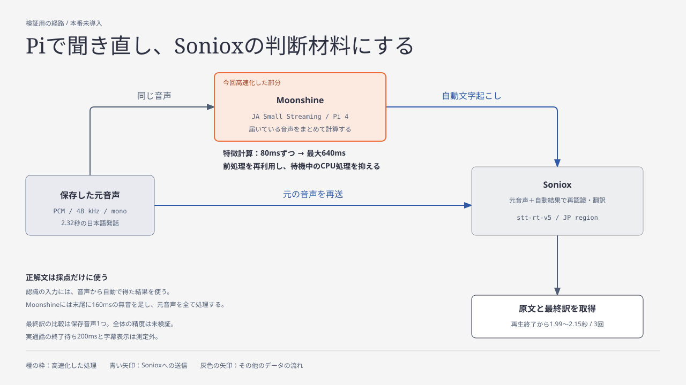

# Raspberry Piでの補助音声認識の高速化

2026年9月15〜16日の検証記録です。**実験用のMoonshineを高速化できましたが、本番のBotには未導入です。** このPRをマージしても、通話中の認識経路は変わりません。

CPUの待機処理を抑えた前回の状態から、音声の特徴計算をまとめる変更を加えました。同じモデルと音声で、補助認識の中央値が **1.064秒から0.818秒**になり、さらに約23%短縮できました。追加の日本語音声5本でも文字起こしは変更前と全文一致し、約22〜27%短縮しています。

Sonioxの最終訳まで含む新しい比較では、中央値は **2.100秒から2.004秒**になりました。通信とSoniox側の処理もあるため、計算単体の23%短縮が、そのまま最終訳までの23%短縮になるわけではありません。

## 文字起こしを改善するために変えたこと

元の問題は、Sonioxによる原文の文字起こしが別の単語になったり、抜けたりすることでした。検証では、**Pi上の別の認識モデルであるMoonshineにも同じ音声を聞かせ、その自動文字起こしをSonioxのヒントにする**経路を試しました。

具体的には、Moonshineの最終結果をSonioxの `context.text` に渡し、Sonioxには元の音声も渡して再認識と翻訳を行わせます。Sonioxが音声を解釈するときに、もう一つの認識結果を候補として参照できるようにする変更です。人が確認した正解文は採点にだけ使い、認識の入力には使っていません。音声モデルの学習や追加学習も行っていません。

この組み合わせで対象語を正しく認識できた例はありますが、報告された他の誤認識は残っています。**以下の高速化は、補助認識の結果を保ったまま待ち時間を減らす変更です。日本語・韓国語の会話全体の精度改善は、まだ確認できていません。**



図はこのSVGを直接編集します。

## なぜ速くなったか

Moonshineのモデルを小さくすることも、音声を削ることもせず、同じ計算の実行方法を変えました。

| 実施した変更 | 速くなる理由 | 確認できた効果 |
| --- | --- | --- |
| 無効だった重みの前処理を有効化した。`session.disable_prepacking=0` | モデルの固定された重みを計算に適した形で保持し、繰り返し使える | 以前の同条件比較で、補助認識が約1.51秒→約1.09秒 |
| 待機中のスレッドがCPUを使い続ける動作を止めた。`session.intra_op.allow_spinning=0`、`session.inter_op.allow_spinning=0` | 仕事がない間のCPU消費を減らす。Piではこの設定で処理時間も短くなった | 9月15日の同条件比較で1.169秒→1.060秒。CPU使用時間も約25%削減 |
| 音声の特徴計算を80msずつから最大640msずつにまとめた | 既に届いた音声をまとめて処理し、細かい呼び出しの繰り返しを減らす。今回の一括処理では1発話あたり30回→4回 | 9月16日の同条件比較で1.064秒→0.818秒（約23%短縮）。CPU使用時間も約27%削減 |

以前の約1.09秒は末尾への無音追加前の値です。今回の速度比較は、改善前後とも同じ160msの無音を追加しています。両者を同じ条件の比較として扱わないでください。

Moonshineは音声の特徴抽出、エンコード、デコードなどに別々のONNX Runtimeセッションを使います。同じ設定オブジェクトを使っていても、Linuxでは各セッションが別の作業スレッド群を持ちます。待機処理を抑える設定でCPU使用時間が減ったことは確認できましたが、各スレッドの競合そのものをトレースしたわけではありません。

速度とは別に、Moonshineを終了する前に160msの無音を加え、2.32秒の元音声を最後まで処理できるようにしました。これは導入を検討しているMoonshine側の末尾処理への対策であり、既存の本番Botが同じ理由で音声を欠落させていたという証拠ではありません。

## 9月16日の追加比較

### 音声の特徴計算をまとめる

Moonshineは音声を文字へ変換する前に、音声の特徴を数値に変換します。元の実装は、その計算を80ms分ずつ繰り返していました。今回は同じ処理へ一度に渡す量を最大640msに増やし、短い計算呼び出しを繰り返す負担を減らしています。640ms分が届くまで待つ変更ではなく、その時点で処理できる音声だけをまとめます。

同じ音声の一括処理3回で、特徴計算の呼び出しは合計90回から12回に減りました。1発話あたりでは30回から4回です。この変更だけを加えた比較で補助認識全体が約23%速くなりましたが、呼び出しの負担と計算内部の効率化がそれぞれ何割を占めるかまでは測定していません。

80ms単位に満たない端数は従来どおり次へ持ち越し、末尾の160msの無音も維持します。モデルの重みや認識語は変更しません。[frontend-batching.patch](frontend-batching.patch) が変更箇所です。

| 条件 | 処理時間の中央値 | CPU使用時間の中央値 | プロセスの最大RSS | 文字起こし |
| --- | ---: | ---: | ---: | --- |
| 前回の待機処理無効化を再測定 | 1.064秒 | 3.218秒 | 355.2MiB | 基準 |
| 最大640msずつ計算 | **0.818秒** | **2.341秒** | 359.2MiB | 3回とも基準と全文一致 |

処理時間は約23%、CPU使用時間は約27%減り、この短い音声での最大RSSの増加は約4MiBでした。最大160ms・320msの候補も測りましたが、補助認識全体の中央値はそれぞれ0.904秒・0.848秒で、640msの候補が最短でした。

別の日本語音声5本（1.32〜16.32秒）でも、変更前後の全文が一致しました。各1回の処理時間は約22〜27%短縮しています。これらには同じ通話の重なる区間が含まれます。**全文一致は、既存の誤認識まで正しくなったことを意味しません。**

生成した信号でも、特徴量と次の計算へ引き継ぐ状態を比較しました。Pi上での最大絶対差は約 `3.6e-7` で、確認用の許容差 `1e-4` を下回りました。[frontend-check.cpp](frontend-check.cpp) は、私的な音声を使わずにこの比較を実行するコードです。

### 最終訳までの比較

前回の設定と新しい設定を `前・後・後・前・前・後` の順で実行しました。順序をランダムにした試験ではありません。

| 条件 | 1回目 | 2回目 | 3回目 | 中央値 | 原文中の対象語・訳語 |
| --- | ---: | ---: | ---: | ---: | --- |
| 前回の設定 | 2.285秒 | 2.064秒 | 2.100秒 | 2.100秒 | 3回とも正解 |
| 特徴計算の集約＋更新方法の調整 | **2.154秒** | **2.004秒** | **1.994秒** | **2.004秒** | 3回とも正解 |

新しい設定では、発話終了からMoonshineの最終結果までが0.697〜0.869秒、Sonioxへの要求から最終訳までが1.285〜1.307秒でした。全体の中央値は約5%短縮しましたが、通信・サービス側の変動も含まれます。

この再生比較では、特徴計算の集約に加えて、音声が400ms進むごとに明示的に更新する方式へ変えています。Python側の自動更新は無効にし、末尾の無音追加では途中計算を始めず、その直後の `stop()` で最終計算を行います。途中結果はSonioxへ渡しません。変更前はPython側・ネイティブ側とも0.5秒の更新間隔でした。このため、全体の短縮を特徴計算の集約だけの効果とはしません。

### 試したが選ばなかった方法

- CPUの並列数を1〜4に変更する方法、グラフ最適化、作業分割の設定では、前回の設定より速い補助認識の中央値を得られなかった。
- 途中の認識結果を検証して再利用する `use_speculative_decoding` も比較したが、最終結果を得るまでの安定した短縮にはつながらなかった。
- 自動更新間隔だけを0.2秒・0.8秒へ変えた候補では、末尾の無音追加で途中計算が走った後、`stop()` が空の最終文字起こしを返した。失敗として記録し、採用していない。明示更新へ切り替えた比較では、最終文字起こしの取得を確認した。

候補ごとの数値と失敗は [measurements.json](measurements.json) の `further_optimization` に保存しています。

## 9月15日の比較

数値の正本は [measurements.json](measurements.json) です。各条件を連続して3回測りました。実行順をランダムにした比較ではありません。

### 補助認識だけの比較

同一の2.32秒の音声に160msの無音を加え、同じモデルの読み込み後に3回処理しました。モデル読み込み時間は含みません。`prepack` が今回の比較基準です。

| 条件 | 処理時間の中央値 | CPU使用時間の中央値 | プロセスの最大RSS | 文字起こし |
| --- | ---: | ---: | ---: | --- |
| 重みの前処理を再利用 (`prepack`) | 1.169秒 | 4.291秒 | 355.9MiB | 基準 |
| 待機処理を無効化 (`thread-nospin`) | **1.060秒** | **3.220秒** | 356.6MiB | 3回とも基準と全文一致 |
| 計算呼び出し終了時だけ待機処理を止める (`thread-stopspin`) | 1.084秒 | 3.840秒 | 359.1MiB | 3回とも基準と全文一致 |

CPU使用時間は全スレッドの合計なので、実際の待ち時間より大きくなります。最大RSSはPythonとモデルを含む単独プロセスの値で、Bot全体の使用量や同時通話時の追加メモリではありません。今回は処理時間とCPU使用時間の両方が小さかった `thread-nospin` を、次の比較に使いました。

### 音声終了からSonioxの最終訳まで

音声を20msずつ実時間に合わせて再生し、Moonshineの最終認識結果を受け取ってから、同じ音声をSonioxへ送りました。Moonshineの途中結果を採用する方法は、この比較には含みません。

| 条件 | 1回目 | 2回目 | 3回目 | 中央値 | 原文中の対象語・訳語 |
| --- | ---: | ---: | ---: | ---: | --- |
| `prepack` | 2.575秒 | 2.924秒 | 2.265秒 | 2.575秒 | 3回とも正解 |
| `thread-nospin` | **2.174秒** | **2.239秒** | **2.019秒** | **2.174秒** | 3回とも正解 |

改善後の内訳は、音声終了から再認識要求の送信までが0.779〜0.957秒、要求送信から最終訳までが1.240〜1.282秒でした。通信とSoniox側の処理時間にも変動があるため、全体の短縮量を全てローカル設定の効果とは断定しません。

以前報告した約2.39秒は、この追加設定を使う前の1回の測定でした。今回の3回はその値を下回りましたが、通話中の遅延上限を保証する結果ではありません。

## 検証条件と変更の再確認

- Raspberry Pi 4 Model B rev 1.5、RAM約3.7GiB。推論はARM64の隔離コンテナで実行。
- Moonshine Voice `0.1.5`、Japanese Small Streaming、モデル版 `quantized_26_08_23`、ONNX Runtime `1.23.2`。
- 音声は48kHz、16bit、モノラル。改善前後で元のPCMの一致をハッシュで確認。
- 採用候補では `decode_incomplete_lines=false`。話者識別・単語時刻推定は使わない。更新方式は各比較の記載とJSONを参照。
- Sonioxは `stt-rt-v5`、日本リージョン、日本語・韓国語の翻訳。同じ元音声と200msの無音を送り、終了を要求。
- モデルの読み込みは再生開始前。WebSocketの接続開始は元音声の終了時。実際のDiscordのパケット到着間隔、字幕送信、読み上げは測定に含まない。
- 再生ファイルの末尾を音声終了としてMoonshineを停止する。Discordからの発話終了通知と、Botの200msの確定猶予は待たない。実通話ではこの時間が加わる可能性がある。また、Soniox接続を閉じずに認識を続ける本番のmanual finalize経路は再現していない。
- 新規の通話録音は行わず、本番の録音設定も変更していない。音声、文字起こし本文、認証情報はこの記録に含めない。

[ort-cpu-options.patch](ort-cpu-options.patch) はORTの3つの設定変更、[frontend-batching.patch](frontend-batching.patch) は特徴計算の集約を保存した差分です。対象は次のコミットです。検証したモデルは上記の日本語Smallの版に限り、他のモデルや古い版へ一律に適用できるとはしていません。

```text
https://github.com/moonshine-ai/moonshine
234f60faa0eb388b01cdf7e60aca232af37aefda (v0.1.5)
core/ort-utils/ort-utils.cpp
```

対象ソースへの適用可否は次のように確認できます。`MOONSHINE_CHECKOUT` は、上記コミットのローカルチェックアウトを指すものとします。

```sh
git -C "$MOONSHINE_CHECKOUT" rev-parse HEAD
git -C "$MOONSHINE_CHECKOUT" apply --check \
  "$PWD/docs/stt-optimization/ort-cpu-options.patch" \
  "$PWD/docs/stt-optimization/frontend-batching.patch"
```

実機測定では、同じ設定関数と、特徴計算を呼ぶメソッドをARM64向けにコンパイルし、`LD_PRELOAD` で一時的に差し替えました。差分を適用してライブラリ全体を再ビルドする確認や、Botへ組み込んだ実装の確認は未実施です。`LD_PRELOAD` の検証手法をそのまま本番構成には採用していません。

生成信号での比較は、同じ版のヘッダー・ライブラリ・モデルを用意した環境で実行できます。`MOONSHINE_LIBRARY_DIR` は `libmoonshine.so` があるディレクトリ、`MOONSHINE_MODEL_DIR` は検証対象のモデルディレクトリです。

```sh
c++ -O2 -std=c++20 docs/stt-optimization/frontend-check.cpp \
  -I "$MOONSHINE_CHECKOUT/core" \
  -I "$MOONSHINE_CHECKOUT/core/bin-tokenizer" \
  -I "$MOONSHINE_CHECKOUT/core/ort-utils" \
  -I "$MOONSHINE_CHECKOUT/core/third-party/onnxruntime/include" \
  -L "$MOONSHINE_LIBRARY_DIR" -lmoonshine \
  -Wl,-rpath,"$MOONSHINE_LIBRARY_DIR" -o /tmp/moonshine-frontend-check
/tmp/moonshine-frontend-check "$MOONSHINE_MODEL_DIR"
```

## 残っている課題

- Sonioxまでの速度比較は、対象語の正解を確認できた日本語の短い発話1つに限る。追加5音声の確認も含め、自然な会話全体の精度向上を示すものではない。
- 正解語を登録しない補助認識で改善した例はあるが、報告された他の誤認識は残っている。
- Moonshine単体に置き換えると、既存の日本語対照音声で誤りが増えた。Sonioxと組み合わせた経路について、日本語・韓国語の対照音声で悪化しないか確認する必要がある。
- 連続発話、同時話者、実際のDiscord受信、字幕・音声出力を含めた遅延とメモリを測る必要がある。

本番に反映されているのは、発話途中の短い無音で確定しないための [PR #27](https://github.com/sota411/discord-translate/pull/27) です。Discordの発話終了通知から確定までの猶予を100msから200msへ延ばし、その間に話が再開したら同じ発話として扱います。117ms後に再開する検証では、途中で確定していた発話をつなげられました。この変更には最大100msの追加待ち時間があり、単語の誤認識を直せたという測定結果ではありません。この記録のMoonshineによる補助認識と、その高速化は実験段階です。

## 一次資料

- [Moonshineのセッション生成](https://github.com/moonshine-ai/moonshine/blob/234f60faa0eb388b01cdf7e60aca232af37aefda/core/moonshine-streaming-model.cpp#L192)：同一環境・設定から複数の計算セッションを作る。
- [MoonshineのORT設定](https://github.com/moonshine-ai/moonshine/blob/234f60faa0eb388b01cdf7e60aca232af37aefda/core/ort-utils/ort-utils.cpp#L82)：Linuxの環境生成と、変更前の前処理設定。
- [ONNX Runtime 1.23.2の設定キー](https://github.com/microsoft/onnxruntime/blob/v1.23.2/include/onnxruntime/core/session/onnxruntime_session_options_config_keys.h)：`disable_prepacking`、`allow_spinning`、`force_spinning_stop` の仕様。
- [ONNX Runtimeのスレッド管理](https://onnxruntime.ai/docs/performance/tune-performance/threading.html)：セッションごとのスレッドと待機処理の説明。
- [Sonioxのコンテキスト入力](https://soniox.com/docs/stt/concepts/context)：自動認識結果を渡す `context.text` の用途。
