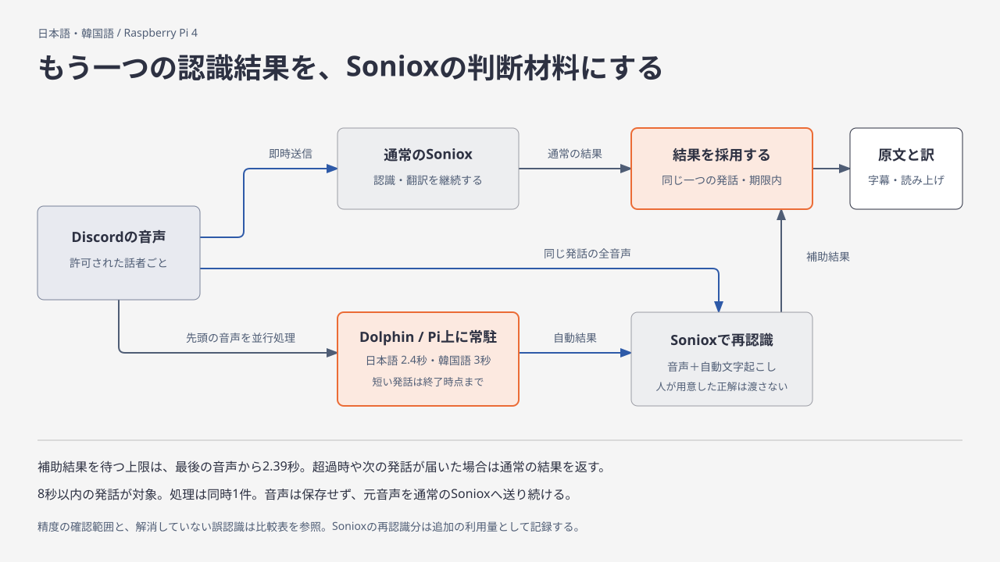

# 日本語・韓国語の補助音声認識

Sonioxの原文認識に、Pi上で動くDolphinの自動認識結果を加える実験です。**本番では無効に戻しました。** 配布イメージをPiで再生した韓国語の試行では、期限内に改善結果を返せたのは3回中1回でした。残る2回は約2.40秒待った末に通常の結果を返しています。この成功率では、本番へ有効化する根拠になりません。

日本語の対照は維持していますが、新たな精度向上は確認できていません。「編み物」の誤認識は残り、相手の韓国語「膝」は録音位置と完全な正解文が未確定です。

## 何を変えたか

通常のSonioxへ音声を送りながら、Dolphinにも発話の先頭を聞かせます。Dolphinの文字起こしをSonioxの `context.text` に渡し、同じ発話の全音声で再認識・翻訳します。人が用意した正解文は採点にだけ使います。モデルの追加学習や、報告された誤りに合わせた単語の追加登録は行っていません。

音声を送る経路と、結果を採用する条件も実装しました。

- 通常のSonioxには、届いた音声を送り続けます。補助処理の完了を待って次の音声を止めることはありません。
- 補助側には先頭の保存済み部分を送った後、続いて届く音声も送ります。Dolphinで処理する長さを制限しても、Sonioxで再認識する発話は先頭だけに切り詰めません。
- 8秒以内の音声、通常側で一つの発話として確定した結果、補助側で一つの発話になった結果を対象にします。通常側の確定要求への応答も確認します。
- 次の音声が届いた場合、途中で別の確定境界が来た場合、言語が混在する場合は補助結果を採用しません。参加者が退出した後の結果は送信しません。
- 補助結果を待つ期限は最後の音声から2,390msです。期限を超えたら通常の結果を返し、理由をログに残します。タイマーや利用量記録の処理時間が加わるため、字幕・読み上げまでの厳密な遅延上限ではありません。

## なぜこの方法を選んだか

元音声については、ユーザーが話し始めから語尾まで聞こえることを確認しています。したがって、音声の欠けだけを原因と決めつけず、別の認識モデルを組み合わせたときの効果を調べました。

Moonshineの韓国語モデルでは対照音声が悪化しました。Whisper smallとSenseVoiceの自動結果をSonioxへ渡す方法も、韓国語の対照3本のうち2本が悪化しました。Dolphinの先頭3秒を使う方法では、現在の本番設定で1本が改善し、残る2本を維持できました。

Dolphinは日本語・韓国語を含む多言語モデルです。公式のsherpa-onnx C APIを使い、モデルとライブラリの版・ハッシュを固定しています。ネイティブ処理は標準入出力で呼び出し、待ち受けポートを追加しません。音声を保存する処理も追加していません。

PR #28の高速化パッチはMoonshine用です。今回の実装はDolphinを使うため、そのパッチは実験記録として残します。Moonshineの日本語で改善した対象語は現在の本番設定でも認識できており、Dolphinと併せてもう一つのモデルを常駐させる根拠は得られませんでした。

## 精度の比較

比較条件はSoniox `stt-rt-v5`、日本リージョン、一般的な会話説明あり、既存の認識用語6件・翻訳用語4件です。同じ元PCMを使い、正解文は認識要求へ渡していません。数値は [bilingual-measurements.json](bilingual-measurements.json) に保存しています。

| 確認用音声 | 通常のSoniox | 補助認識あり | 判断 |
| --- | ---: | ---: | --- |
| 韓国語・選択についての発話 | 2文字編集 / 32文字 | **0 / 32** | この1本で改善 |
| 韓国語・通常の会話 | 5 / 212 | 5 / 212 | 維持。差は数字の表記に由来 |
| 韓国語・別の会話の冒頭 | 0 / 90 | 0 / 90 | 維持 |
| 日本語・正常な対照音声 | 0 / 55 | 0 / 55 | 維持 |
| 日本語・「裁縫」の対象語 | 正しく認識 | 正しく認識 | 本番設定に対する新たな改善とは数えない |
| 日本語・「編み物」の対象語 | 誤認識 | 誤認識 | 未解消 |
| 日本語話者による韓国語の引用語 | 誤認識 | 誤認識が残る | 未解消 |
| 韓国語・「膝」の報告箇所 | 対象語なし | 対象語なし | 完全文の正解と録音位置を確定できていない |

文字編集数は、句読点・記号・空白を除き、NFKCで正規化した原文の比較です。数字とその読みの違いも誤差に含むため、5文字編集を5箇所の意味の誤りとは扱いません。「裁縫」は正解が文全体ではないため、挿入文字数をそのまま誤認識数とは扱いません。

この表の長い対照音声は、実装の8秒制限を超えるものも含む一括再生の比較です。その全体が実通話で補助認識の採用対象になることや、短い個々の発話も同じ精度になることを証明するものではありません。

## 待ち時間とメモリ

Pi 4で3秒分のDolphinを常駐させて繰り返し実行すると、処理時間は約1.48秒でした。CPUのスレッド数1・2・3・4を比べ、4が最速でした。最大RSSは約354MiBで、Bot全体や他サービスの使用量は含みません。

さらに、発話終了を待つ前に処理を始めました。韓国語では先頭3秒を使います。日本語では先頭2.4秒でも対象語を維持できたため、処理を早く始めます。どちらも、その長さより短い発話は終了後にそこまでの音声を処理します。韓国語を2.4秒に縮めると、改善した対照で誤りが1文字残りました。

公式WebSocketサーバーを使ったPi上の実時間再生では、韓国語6.2秒の音声が発話終了から2.31〜2.37秒、日本語3.12秒の音声が2.30〜2.36秒で最終結果に達しました。日本語も3秒を使った比較は3.17秒でした。この違いは、音声を処理し始める時刻と計算量によるものです。

本番実装では、モデルを読み込んだ後に無音で一度処理してから起動を完了します。最初の発話でネイティブ処理の初回負荷を負担させないためです。本番実装をPi上で再生した5回では、韓国語は2回とも対象の誤認識を解消し、2.34〜2.37秒で返りました。日本語の「裁縫」は1回が2.21秒で補助結果を採用し、もう1回は期限を超えて通常の結果を約2.40秒で返しました。どちらも対象語は正しいままです。「編み物」は約2.08秒でしたが誤認識は残りました。通信とサービス側の時間も変動するため、全ての発話で補助結果を採用できるとはしていません。

この比較は実装したPCM処理、確定要求、発話の対応付け、利用量記録を通しています。起動時の予備処理を加える前には、韓国語の初回で期限超過も記録しています。予備処理を加えた後の同じ試験で改善しましたが、通信変動もあるため、差の全てをその効果とは断定しません。

### 配布後の計測で分かったこと

本番を無効に戻した後、配布イメージと同じ音声・設定で工程ごとの時刻を測りました。試行順と回数を先に固定し、韓国語4回、日本語の「裁縫」「編み物」を各1回再生しています。

韓国語4回では、Dolphinの計算は1.51〜1.67秒かかりましたが、発話終了の1.53〜1.69秒前に完了しています。補助側のSonioxも発話終了の1.28〜1.51秒前に接続済みでした。それでも認識・翻訳のトークンが終了後2秒以上にわたって届き続け、4回とも最終応答を受け取る前に期限を超えました。台帳への記録にかかった数msだけでは、この待ち時間を説明できません。

分かったのは、ローカル認識が終わるまで補助側の再認識を始められず、その後の処理待ちが期限に収まらないことです。ネイティブ処理の初回準備だけが原因ではありません。サーバー内部の処理時間と通信時間の内訳は未確定です。

比較用のプロセスでは、200msの無音と発話の採用条件を保ち、補助側の終了方法だけを[手動確定](https://soniox.com/docs/stt/rt/manual-finalization)へ変えました。同じ順序の6回で韓国語は1/4回だけ完了（2.378秒、編集2文字→0文字）し、3回は期限超過でした。「編み物」の誤りも残ったため、この変更は採用していません。過去の成功例を含め、期限超過した試行も数値記録に残しています。

## 有効化と運用

Dockerイメージにモデルと実行ファイルを含めていますが、Pi用Composeも含め、補助認識の既定値は `false` です。無効時はモデルを起動せず、補助結果を待たずに通常のSoniox結果を返します。精度と待ち時間の両方を繰り返し確認できるまで、本番では有効にしません。ローカルで `pnpm dev` を実行する環境では、実行ファイルの別途配置が必要です。

配布イメージの韓国語3回は、同じPCMと本番設定で、期限超過2回（2,403ms・2,396ms）、完了1回（2,147ms、32文字中の編集2文字→0文字）でした。通常結果は約422〜447msで届いています。期限超過時に通常結果を保持できたことは、精度改善には数えません。

補助処理はBot全体で同時1件に制限します。処理中に別の話者が話した場合は通常の認識を使い、待ち行列を作りません。日本語・韓国語ペアではSonioxの同時STT枠を追加1件見込み、再送した音声・追加の文字情報を既存の利用量台帳に記録します。Sonioxの再認識分の料金は増えますが、別の有料音声認識サービスは使いません。

自然な発話終端が手動の確定要求より先に届いた場合も、静かになってから確定応答を取得し、次の発話で補助処理を再開します。通常の字幕はその応答を待たずに送ります。

`translation_flow` の `stt_refinement_completed`、`unchanged`、`busy`、`deadline`、`ineligible` に、採用または不採用の理由を記録します。音声本文をログへ出しません。モデル起動、API、利用量記録の異常はエラーとして扱います。

実際のDiscord通話、同時話者、字幕送信・読み上げを含む品質と遅延は、録音再生だけでは確認できません。会話全体の精度向上や、報告された全ての誤認識の解消を保証するものではありません。

## 検証

`pnpm verify` は256件のテスト、lint、型検査、ビルド、既存ネイティブ依存の起動、図版の整合を通過しました。回帰テストでは、補助側へ送る音声の一致、期限超過、遅れて届く音声、自然な発話終端の後の再開、後から参加した韓国語話者、退出後の送信停止を確認しています。

amd64の完成イメージでは、ネットワークと認証情報を使わずに `node scripts/smoke-runtime.mjs --dolphin` が通りました。Pi上ではARM64の実行ファイルと本番の処理経路を使い、前述の音声再生を確認しています。完成したARM64イメージの確認は、配備時にも実行します。

## 一次資料

- [Dolphinの対応言語](https://github.com/DataoceanAI/Dolphin/blob/78ea615194777f91a3970ff010b5d678d0bbf5f0/languages.md)
- [sherpa-onnxのDolphinモデル](https://k2-fsa.github.io/sherpa/onnx/Dolphin/pretrained.html)
- [固定版のC API使用例](https://github.com/k2-fsa/sherpa-onnx/blob/v1.13.8/c-api-examples/dolphin-ctc-c-api.c)
- [Sonioxのコンテキスト入力](https://soniox.com/docs/stt/concepts/context)
